# LingBot-Map long-model real-sequence end-to-end comparison

Campaign inputs are the official demo sequences (`robbyant/lingbot-map-demo`), extracted with the official demo.py video rule (fps=10) and the official crop rule; both engines consume byte-identical `float32` frames. Both engines run the official streaming profile `scale=8/window=64` with the official auto `keyframe_interval = ceil(N/320)` (explicit on both sides).

> No ground truth exists for these sequences: accuracy rows measure > cross-engine agreement (GGML vs decoded-GGUF PyTorch mirror = > engine parity; vs fp32 checkpoint = total deviation incl. weight > format). Depth absolute metrics are depth-scale-weighted; the REL > column normalizes by mean|depth_ref|.

## lingbo_world — N=667, 518x308, auto kf=3

| row | reference | pose RMSE | depth RMSE | depth REL | tail% |
|---|---|---|---|---|---|
| ggml_bal_f16_flash_cuda | bal_mf16 | 1.08e-03 | 1.83e-04 | 3.40e-04 | 0.25 |
| ggml_bal_f16_flash_cuda | bal_fp32 | 2.37e-03 | 6.90e-04 | 1.28e-03 | 1.52 |
| ggml_bal_f16_flash_vulkan | bal_mf16 | 1.27e-03 | 1.19e-04 | 2.22e-04 | 0.07 |
| ggml_bal_f16_flash_vulkan | bal_fp32 | 8.17e-04 | 6.31e-04 | 1.17e-03 | 1.28 |
| ggml_bal_f16_strict_cuda | bal_mf16 | 3.32e-04 | 8.34e-05 | 1.55e-04 | 0.03 |
| ggml_bal_f16_strict_cuda | bal_fp32 | 1.69e-03 | 6.32e-04 | 1.18e-03 | 1.32 |
| ggml_bal_f16_strict_vulkan | bal_mf16 | 1.59e-04 | 7.74e-05 | 1.44e-04 | 0.02 |
| ggml_bal_f16_strict_vulkan | bal_fp32 | 1.52e-03 | 6.21e-04 | 1.16e-03 | 1.27 |
| ggml_bal_f32_flash_cuda | bal_fp32 | 1.06e-03 | 1.42e-04 | 2.65e-04 | 0.10 |
| ggml_bal_f32_flash_cuda | bal_fp32 | 1.06e-03 | 1.42e-04 | 2.65e-04 | 0.10 |
| ggml_bal_f32_flash_vulkan | bal_fp32 | 1.42e-03 | 1.16e-04 | 2.16e-04 | 0.06 |
| ggml_bal_f32_flash_vulkan | bal_fp32 | 1.42e-03 | 1.16e-04 | 2.16e-04 | 0.06 |
| ggml_bal_f32_strict_cuda | bal_fp32 | 3.16e-04 | 8.46e-05 | 1.57e-04 | 0.04 |
| ggml_bal_f32_strict_cuda | bal_fp32 | 3.16e-04 | 8.46e-05 | 1.57e-04 | 0.04 |
| ggml_bal_f32_strict_vulkan | bal_fp32 | 1.63e-04 | 7.97e-05 | 1.48e-04 | 0.04 |
| ggml_bal_f32_strict_vulkan | bal_fp32 | 1.63e-04 | 7.97e-05 | 1.48e-04 | 0.04 |
| ggml_bal_q8_flash_cuda | bal_mq8 | 1.12e-03 | 1.63e-04 | 3.03e-04 | 0.18 |
| ggml_bal_q8_flash_cuda | bal_fp32 | 3.36e-03 | 5.83e-03 | 1.09e-02 | 12.23 |
| ggml_bal_q8_flash_vulkan | bal_mq8 | 1.33e-03 | 1.37e-04 | 2.55e-04 | 0.11 |
| ggml_bal_q8_flash_vulkan | bal_fp32 | 2.60e-03 | 5.87e-03 | 1.09e-02 | 12.16 |
| ggml_bal_q8_strict_cuda | bal_mq8 | 1.20e-04 | 8.08e-05 | 1.51e-04 | 0.03 |
| ggml_bal_q8_strict_cuda | bal_fp32 | 2.78e-03 | 5.84e-03 | 1.09e-02 | 12.05 |
| ggml_bal_q8_strict_vulkan | bal_mq8 | 9.06e-05 | 7.83e-05 | 1.46e-04 | 0.02 |
| ggml_bal_q8_strict_vulkan | bal_fp32 | 2.76e-03 | 5.84e-03 | 1.09e-02 | 12.04 |
| ggml_long_f16_flash_cuda | long_mf16 | 5.64e-04 | 6.49e-04 | 7.28e-04 | 1.74 |
| ggml_long_f16_flash_cuda | long_fp32 | 6.51e-04 | 1.87e-03 | 2.09e-03 | 5.45 |
| ggml_long_f16_flash_vulkan | long_mf16 | 3.81e-04 | 5.98e-04 | 6.71e-04 | 1.99 |
| ggml_long_f16_flash_vulkan | long_fp32 | 4.95e-04 | 2.10e-03 | 2.36e-03 | 6.12 |
| ggml_long_f16_strict_cuda | long_mf16 | 1.52e-04 | 5.08e-04 | 5.70e-04 | 1.51 |
| ggml_long_f16_strict_cuda | long_fp32 | 4.33e-04 | 2.06e-03 | 2.31e-03 | 5.71 |
| ggml_long_f16_strict_vulkan | long_mf16 | 1.31e-04 | 5.40e-04 | 6.06e-04 | 1.51 |
| ggml_long_f16_strict_vulkan | long_fp32 | 4.53e-04 | 2.08e-03 | 2.33e-03 | 5.56 |
| ggml_long_f32_flash_cuda | long_fp32 | 5.19e-04 | 6.02e-04 | 6.75e-04 | 2.10 |
| ggml_long_f32_flash_cuda | long_fp32 | 5.19e-04 | 6.02e-04 | 6.75e-04 | 2.10 |
| ggml_long_f32_flash_vulkan | long_fp32 | 3.95e-04 | 5.84e-04 | 6.55e-04 | 2.19 |
| ggml_long_f32_flash_vulkan | long_fp32 | 3.95e-04 | 5.84e-04 | 6.55e-04 | 2.19 |
| ggml_long_f32_strict_cuda | long_fp32 | 1.17e-04 | 5.06e-04 | 5.67e-04 | 1.75 |
| ggml_long_f32_strict_cuda | long_fp32 | 1.17e-04 | 5.06e-04 | 5.67e-04 | 1.75 |
| ggml_long_f32_strict_vulkan | long_fp32 | 2.56e-04 | 5.00e-04 | 5.60e-04 | 1.70 |
| ggml_long_f32_strict_vulkan | long_fp32 | 2.56e-04 | 5.00e-04 | 5.60e-04 | 1.70 |
| ggml_long_q8_flash_cuda | long_mq8 | 4.29e-04 | 6.57e-04 | 7.39e-04 | 2.25 |
| ggml_long_q8_flash_cuda | long_fp32 | 6.03e-03 | 1.69e-02 | 1.90e-02 | 27.87 |
| ggml_long_q8_flash_vulkan | long_mq8 | 5.40e-04 | 6.04e-04 | 6.79e-04 | 1.83 |
| ggml_long_q8_flash_vulkan | long_fp32 | 5.22e-03 | 1.72e-02 | 1.93e-02 | 28.01 |
| ggml_long_q8_strict_cuda | long_mq8 | 2.25e-04 | 4.58e-04 | 5.15e-04 | 1.27 |
| ggml_long_q8_strict_cuda | long_fp32 | 5.61e-03 | 1.70e-02 | 1.91e-02 | 28.28 |
| ggml_long_q8_strict_vulkan | long_mq8 | 8.35e-05 | 5.08e-04 | 5.70e-04 | 1.76 |
| ggml_long_q8_strict_vulkan | long_fp32 | 5.62e-03 | 1.70e-02 | 1.90e-02 | 28.25 |
| pt_long_bf16 | long_fp32 (PT self-noise) | 1.30e-02 | 4.63e-02 | 5.20e-02 | 49.18 |
| pt_bal_bf16 | bal_fp32 (PT self-noise) | 7.66e-03 | 1.13e-02 | 2.09e-02 | 34.78 |

| row | wall (s) | FPS | proc GPU peak (MB) | RSS peak (MB) | util % |
|---|---|---|---|---|---|
| ggml_bal_f16_flash_cuda | 263.6 | 2.53 | 13868 | 9394 | 68 |
| ggml_bal_f16_flash_vulkan | 314.6 | 2.12 | 17874 | 11243 | 67 |
| ggml_bal_f16_strict_cuda | 847.0 | 0.79 | 13868 | 9393 | 89 |
| ggml_bal_f16_strict_vulkan | 859.0 | 0.78 | 17874 | 11240 | 88 |
| ggml_bal_f32_flash_cuda | 260.7 | 2.56 | 18168 | 11596 | 65 |
| ggml_bal_f32_flash_vulkan | 317.0 | 2.10 | 21982 | 15627 | 74 |
| ggml_bal_f32_strict_cuda | 850.5 | 0.78 | 18168 | 11636 | 90 |
| ggml_bal_f32_strict_vulkan | 859.5 | 0.78 | 21982 | 15632 | 88 |
| ggml_bal_q8_flash_cuda | 268.6 | 2.48 | 11862 | 8391 | 66 |
| ggml_bal_q8_flash_vulkan | 315.1 | 2.12 | 15867 | 9236 | 73 |
| ggml_bal_q8_strict_cuda | 853.3 | 0.78 | 11862 | 8390 | 90 |
| ggml_bal_q8_strict_vulkan | 865.2 | 0.77 | 15867 | 9230 | 88 |
| ggml_long_f16_flash_cuda | 276.2 | 2.41 | 13868 | 9392 | 67 |
| ggml_long_f16_flash_vulkan | 323.3 | 2.06 | 17874 | 11243 | 66 |
| ggml_long_f16_strict_cuda | 847.4 | 0.79 | 13868 | 9393 | 90 |
| ggml_long_f16_strict_vulkan | 859.3 | 0.78 | 17874 | 11232 | 88 |
| ggml_long_f32_flash_cuda | 261.2 | 2.55 | 18168 | 11599 | 66 |
| ggml_long_f32_flash_vulkan | 318.8 | 2.09 | 21982 | 15627 | 66 |
| ggml_long_f32_strict_cuda | 846.5 | 0.79 | 18168 | 11598 | 90 |
| ggml_long_f32_strict_vulkan | 870.2 | 0.77 | 21982 | 15632 | 87 |
| ggml_long_q8_flash_cuda | 279.9 | 2.38 | 11862 | 8391 | 72 |
| ggml_long_q8_flash_vulkan | 317.6 | 2.10 | 15867 | 9233 | 73 |
| ggml_long_q8_strict_cuda | 848.7 | 0.79 | 11862 | 8390 | 91 |
| ggml_long_q8_strict_vulkan | 861.6 | 0.77 | 15867 | 9230 | 90 |
| pt_bal_bf16 | 129.6 | 5.15 | 19380 | 12544 | 82 |
| pt_bal_fp32 | 302.9 | 2.20 | 19776 | 12184 | 89 |
| pt_bal_mf16 | 297.4 | 2.24 | 19776 | 12557 | 90 |
| pt_bal_mq8 | 302.4 | 2.21 | 19776 | 12532 | 89 |
| pt_long_bf16 | 139.3 | 4.79 | 19380 | 12330 | 75 |
| pt_long_fp32 | 416.7 | 1.60 | 21836 | 12564 | 94 |
| pt_long_mf16 | 298.0 | 2.24 | 19776 | 13039 | 90 |
| pt_long_mq8 | 296.4 | 2.25 | 19776 | 12460 | 91 |

| checkpoint | mean \|depth\| | depth p95 | trajectory length |
|---|---|---|---|
| long | 0.890 | 3.281 | 129.90 |
| bal | 0.537 | 1.428 | 133.75 |

| cloud A | cloud B | symmetric NN RMSE |
|---|---|---|
| pt_long_fp32 | pt_bal_fp32 | 0.5653 |
| pt_long_fp32 | ggml_long_f16_flash_cuda | 0.0612 |
| pt_long_fp32 | ggml_bal_f16_flash_cuda | 0.5871 |
| pt_bal_fp32 | ggml_long_f16_flash_cuda | 0.5467 |
| pt_bal_fp32 | ggml_bal_f16_flash_cuda | 0.0794 |
| ggml_long_f16_flash_cuda | ggml_bal_f16_flash_cuda | 0.5612 |

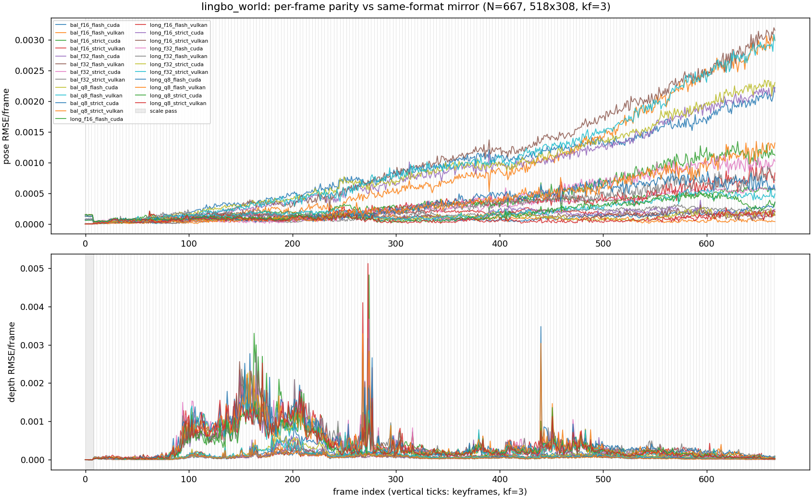

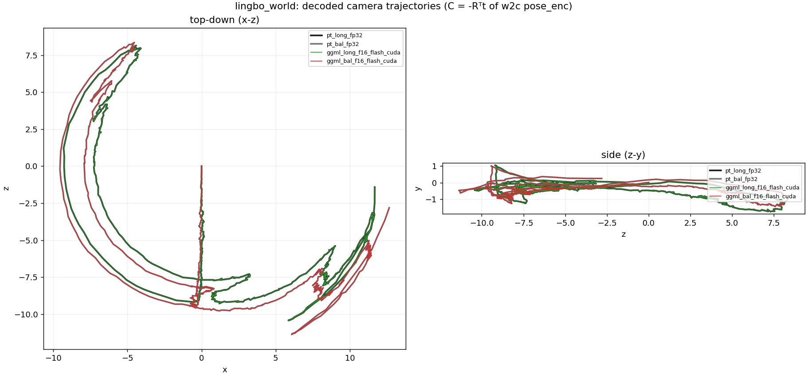

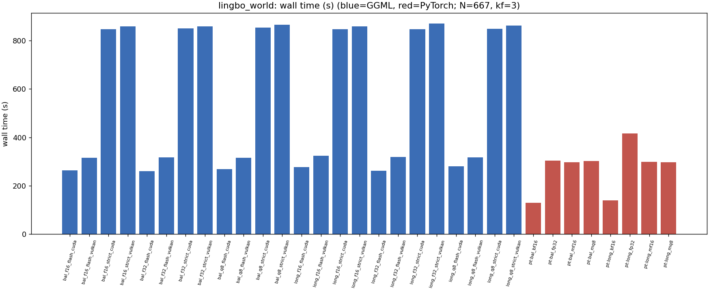

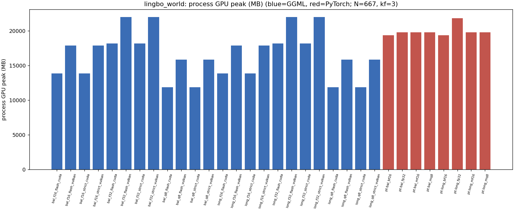

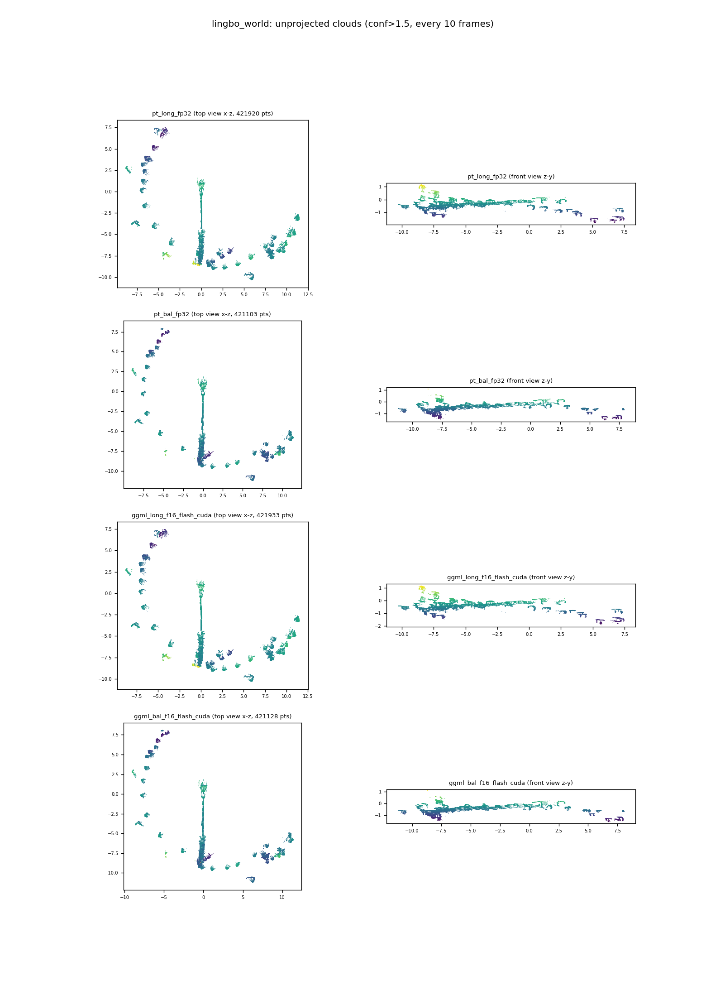

## drive — N=1050, 518x294, auto kf=4

| row | reference | pose RMSE | depth RMSE | depth REL | tail% |
|---|---|---|---|---|---|
| ggml_bal_f16_flash_cuda | bal_mf16 | 8.17e-03 | 5.84e-04 | 8.79e-04 | 0.79 |
| ggml_bal_f16_flash_cuda | bal_fp32 | 9.95e-03 | 1.28e-03 | 1.93e-03 | 2.96 |
| ggml_bal_f16_flash_vulkan | bal_mf16 | 4.29e-03 | 1.98e-04 | 2.99e-04 | 0.20 |
| ggml_bal_f16_flash_vulkan | bal_fp32 | 3.32e-03 | 1.04e-03 | 1.57e-03 | 2.17 |
| ggml_bal_f16_strict_cuda | bal_mf16 | 1.83e-03 | 1.40e-04 | 2.10e-04 | 0.11 |
| ggml_bal_f16_strict_cuda | bal_fp32 | 4.05e-03 | 1.04e-03 | 1.57e-03 | 2.23 |
| ggml_bal_f16_strict_vulkan | bal_mf16 | 9.20e-04 | 1.23e-04 | 1.85e-04 | 0.10 |
| ggml_bal_f16_strict_vulkan | bal_fp32 | 3.23e-03 | 1.03e-03 | 1.55e-03 | 2.18 |
| ggml_bal_f32_flash_cuda | bal_fp32 | 7.51e-03 | 6.59e-04 | 9.93e-04 | 0.87 |
| ggml_bal_f32_flash_cuda | bal_fp32 | 7.51e-03 | 6.59e-04 | 9.93e-04 | 0.87 |
| ggml_bal_f32_flash_vulkan | bal_fp32 | 4.28e-03 | 1.88e-04 | 2.83e-04 | 0.17 |
| ggml_bal_f32_flash_vulkan | bal_fp32 | 4.28e-03 | 1.88e-04 | 2.83e-04 | 0.17 |
| ggml_bal_f32_strict_cuda | bal_fp32 | 1.73e-03 | 1.44e-04 | 2.17e-04 | 0.13 |
| ggml_bal_f32_strict_cuda | bal_fp32 | 1.73e-03 | 1.44e-04 | 2.17e-04 | 0.13 |
| ggml_bal_f32_strict_vulkan | bal_fp32 | 9.30e-04 | 1.17e-04 | 1.77e-04 | 0.09 |
| ggml_bal_f32_strict_vulkan | bal_fp32 | 9.30e-04 | 1.17e-04 | 1.77e-04 | 0.09 |
| ggml_bal_q8_flash_cuda | bal_mq8 | 7.89e-03 | 6.43e-04 | 9.69e-04 | 0.91 |
| ggml_bal_q8_flash_cuda | bal_fp32 | 1.34e-02 | 9.70e-03 | 1.46e-02 | 19.82 |
| ggml_bal_q8_flash_vulkan | bal_mq8 | 6.11e-03 | 1.95e-04 | 2.94e-04 | 0.21 |
| ggml_bal_q8_flash_vulkan | bal_fp32 | 2.38e-02 | 9.81e-03 | 1.48e-02 | 18.99 |
| ggml_bal_q8_strict_cuda | bal_mq8 | 1.16e-03 | 1.66e-04 | 2.49e-04 | 0.17 |
| ggml_bal_q8_strict_cuda | bal_fp32 | 1.77e-02 | 9.78e-03 | 1.47e-02 | 19.01 |
| ggml_bal_q8_strict_vulkan | bal_mq8 | 6.85e-04 | 1.39e-04 | 2.09e-04 | 0.13 |
| ggml_bal_q8_strict_vulkan | bal_fp32 | 1.91e-02 | 9.79e-03 | 1.48e-02 | 18.91 |
| ggml_long_f16_flash_cuda | long_mf16 | 1.02e-02 | 1.33e-03 | 9.28e-04 | 7.94 |
| ggml_long_f16_flash_cuda | long_fp32 | 8.21e-03 | 3.28e-03 | 2.29e-03 | 11.62 |
| ggml_long_f16_flash_vulkan | long_mf16 | 8.32e-03 | 7.95e-04 | 5.55e-04 | 3.32 |
| ggml_long_f16_flash_vulkan | long_fp32 | 1.12e-02 | 3.83e-03 | 2.68e-03 | 12.48 |
| ggml_long_f16_strict_cuda | long_mf16 | 3.91e-03 | 6.71e-04 | 4.69e-04 | 2.30 |
| ggml_long_f16_strict_cuda | long_fp32 | 2.57e-03 | 3.71e-03 | 2.59e-03 | 12.41 |
| ggml_long_f16_strict_vulkan | long_mf16 | 2.58e-03 | 6.48e-04 | 4.53e-04 | 2.15 |
| ggml_long_f16_strict_vulkan | long_fp32 | 2.53e-03 | 3.76e-03 | 2.63e-03 | 12.36 |
| ggml_long_f32_flash_cuda | long_fp32 | 9.21e-03 | 1.28e-03 | 8.91e-04 | 8.32 |
| ggml_long_f32_flash_cuda | long_fp32 | 9.21e-03 | 1.28e-03 | 8.91e-04 | 8.32 |
| ggml_long_f32_flash_vulkan | long_fp32 | 7.93e-03 | 8.41e-04 | 5.87e-04 | 3.36 |
| ggml_long_f32_flash_vulkan | long_fp32 | 7.93e-03 | 8.41e-04 | 5.87e-04 | 3.36 |
| ggml_long_f32_strict_cuda | long_fp32 | 1.93e-03 | 6.55e-04 | 4.57e-04 | 2.18 |
| ggml_long_f32_strict_cuda | long_fp32 | 1.93e-03 | 6.55e-04 | 4.57e-04 | 2.18 |
| ggml_long_f32_strict_vulkan | long_fp32 | 1.67e-03 | 6.44e-04 | 4.50e-04 | 2.09 |
| ggml_long_f32_strict_vulkan | long_fp32 | 1.67e-03 | 6.44e-04 | 4.50e-04 | 2.09 |
| ggml_long_q8_flash_cuda | long_mq8 | 1.04e-02 | 1.29e-03 | 9.08e-04 | 7.97 |
| ggml_long_q8_flash_cuda | long_fp32 | 3.78e-02 | 4.29e-02 | 2.99e-02 | 34.13 |
| ggml_long_q8_flash_vulkan | long_mq8 | 5.72e-03 | 8.45e-04 | 5.94e-04 | 3.23 |
| ggml_long_q8_flash_vulkan | long_fp32 | 2.56e-02 | 4.35e-02 | 3.03e-02 | 34.68 |
| ggml_long_q8_strict_cuda | long_mq8 | 1.58e-03 | 6.85e-04 | 4.81e-04 | 2.27 |
| ggml_long_q8_strict_cuda | long_fp32 | 3.02e-02 | 4.33e-02 | 3.02e-02 | 34.53 |
| ggml_long_q8_strict_vulkan | long_mq8 | 1.48e-03 | 6.37e-04 | 4.47e-04 | 2.01 |
| ggml_long_q8_strict_vulkan | long_fp32 | 2.98e-02 | 4.33e-02 | 3.03e-02 | 34.62 |
| pt_long_bf16 | long_fp32 (PT self-noise) | 2.10e-01 | 1.82e-01 | 1.27e-01 | 50.80 |
| pt_bal_bf16 | bal_fp32 (PT self-noise) | 7.68e-02 | 7.60e-02 | 1.15e-01 | 47.85 |
| ggml_long_q8mix_strict_cuda | long_q8mix | 1.54e-03 | 6.81e-04 | 4.76e-04 | 2.30 |
| ggml_long_q8mix_strict_cuda | long_fp32 | 3.13e-02 | 4.52e-02 | 3.13e-02 | 34.63 |
| ggml_long_q8mix_flash_cuda | long_q8mix | 1.04e-02 | 1.31e-03 | 9.12e-04 | 8.11 |
| ggml_long_q8mix_flash_cuda | long_fp32 | 4.01e-02 | 4.48e-02 | 3.11e-02 | 34.23 |

| row | wall (s) | FPS | proc GPU peak (MB) | RSS peak (MB) | util % |
|---|---|---|---|---|---|
| ggml_bal_f16_flash_cuda | 397.4 | 2.64 | 13440 | 10294 | 70 |
| ggml_bal_f16_flash_vulkan | 464.5 | 2.26 | 17365 | 12088 | 71 |
| ggml_bal_f16_strict_cuda | 1298.7 | 0.81 | 13440 | 10249 | 91 |
| ggml_bal_f16_strict_vulkan | 1501.2 | 0.70 | 17365 | 12035 | 89 |
| ggml_bal_f32_flash_cuda | 391.1 | 2.69 | 17764 | 12509 | 68 |
| ggml_bal_f32_flash_vulkan | 473.6 | 2.22 | 21388 | 16424 | 73 |
| ggml_bal_f32_strict_cuda | 1294.0 | 0.81 | 17764 | 12401 | 91 |
| ggml_bal_f32_strict_vulkan | 1458.3 | 0.72 | 21388 | 16521 | 90 |
| ggml_bal_q8_flash_cuda | 400.6 | 2.62 | 11434 | 9194 | 66 |
| ggml_bal_q8_flash_vulkan | 485.5 | 2.16 | 15358 | 10029 | 71 |
| ggml_bal_q8_strict_cuda | 1732.6 | 0.61 | 11434 | 9194 | 95 |
| ggml_bal_q8_strict_vulkan | 1428.6 | 0.73 | 15358 | 10306 | 90 |
| ggml_long_f16_flash_cuda | 403.5 | 2.60 | 13440 | 10662 | 67 |
| ggml_long_f16_flash_vulkan | 464.1 | 2.26 | 17365 | 12088 | 71 |
| ggml_long_f16_strict_cuda | 1299.6 | 0.81 | 13440 | 10611 | 90 |
| ggml_long_f16_strict_vulkan | 1426.9 | 0.74 | 17365 | 11954 | 91 |
| ggml_long_f32_flash_cuda | 390.2 | 2.69 | 17764 | 12696 | 69 |
| ggml_long_f32_flash_vulkan | 493.6 | 2.13 | 21388 | 16482 | 70 |
| ggml_long_f32_strict_cuda | 1288.3 | 0.81 | 17764 | 12585 | 91 |
| ggml_long_f32_strict_vulkan | 1496.1 | 0.70 | 21388 | 16446 | 91 |
| ggml_long_q8_flash_cuda | 403.7 | 2.60 | 11434 | 9195 | 70 |
| ggml_long_q8_flash_vulkan | 481.1 | 2.18 | 15358 | 10026 | 69 |
| ggml_long_q8_strict_cuda | 1299.5 | 0.81 | 11434 | 9194 | 91 |
| ggml_long_q8_strict_vulkan | 1449.6 | 0.72 | 15358 | 10029 | 90 |
| pt_bal_bf16 | 199.5 | 5.26 | 19050 | 14424 | 83 |
| pt_bal_fp32 | 461.1 | 2.28 | 19568 | 14136 | 91 |
| pt_bal_mf16 | 458.0 | 2.29 | 19568 | 14353 | 91 |
| pt_bal_mq8 | 458.2 | 2.29 | 19568 | 13768 | 91 |
| pt_long_bf16 | 204.7 | 5.13 | 19050 | 14329 | 80 |
| pt_long_fp32 | 458.0 | 2.29 | 19568 | 14287 | 91 |
| pt_long_mf16 | 458.5 | 2.29 | 19568 | 14273 | 91 |
| pt_long_mq8 | 457.6 | 2.29 | 19568 | 14026 | 91 |

| checkpoint | mean \|depth\| | depth p95 | trajectory length |
|---|---|---|---|
| long | 1.441 | 6.933 | 3208.00 |
| bal | 0.664 | 1.714 | 2401.23 |

| cloud A | cloud B | symmetric NN RMSE |
|---|---|---|
| pt_long_fp32 | pt_bal_fp32 | 6.8611 |
| pt_long_fp32 | ggml_long_f16_flash_cuda | 4.1173 |
| pt_long_fp32 | ggml_bal_f16_flash_cuda | 7.0842 |
| pt_bal_fp32 | ggml_long_f16_flash_cuda | 5.8851 |
| pt_bal_fp32 | ggml_bal_f16_flash_cuda | 2.1503 |
| ggml_long_f16_flash_cuda | ggml_bal_f16_flash_cuda | 5.3999 |

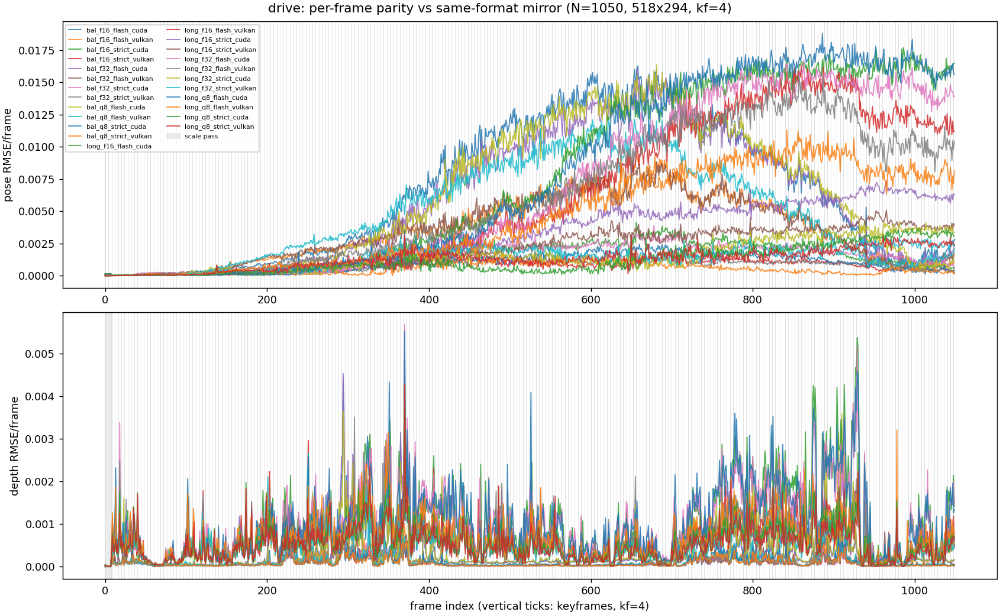

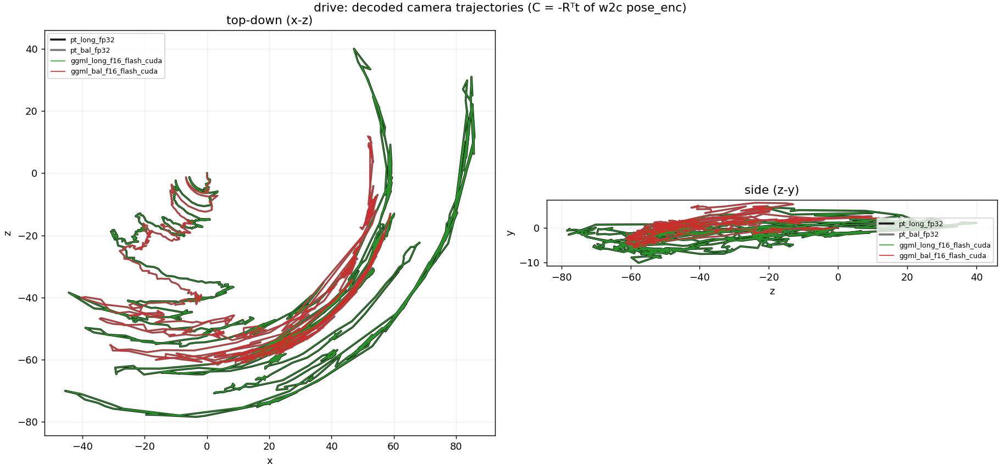

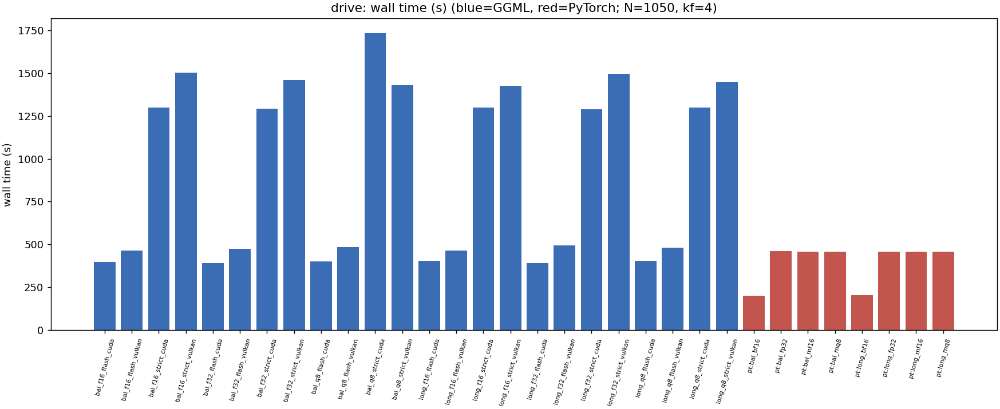

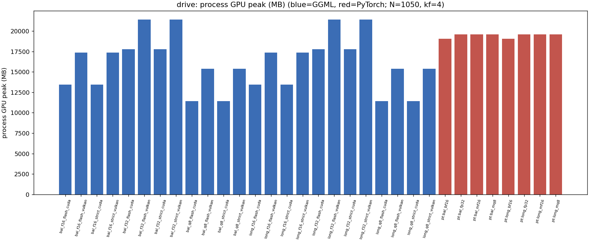

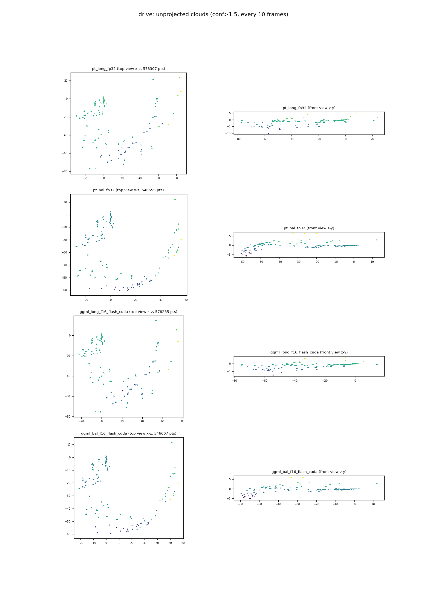

## indoor — N=2000, 518x294, auto kf=7

| row | reference | pose RMSE | depth RMSE | depth REL | tail% |
|---|---|---|---|---|---|
| ggml_bal_f16_flash_cuda | bal_mf16 | 1.88e-03 | 2.69e-04 | 2.44e-04 | 0.08 |
| ggml_bal_f16_flash_cuda | bal_fp32 | 1.80e-03 | 4.37e-04 | 3.97e-04 | 0.55 |
| ggml_bal_f16_flash_vulkan | bal_mf16 | 6.06e-04 | 9.93e-05 | 9.02e-05 | 0.03 |
| ggml_bal_f16_flash_vulkan | bal_fp32 | 1.22e-03 | 3.22e-04 | 2.92e-04 | 0.32 |
| ggml_bal_f16_strict_cuda | bal_mf16 | 4.08e-04 | 6.98e-05 | 6.34e-05 | 0.01 |
| ggml_bal_f16_strict_cuda | bal_fp32 | 1.23e-03 | 3.23e-04 | 2.93e-04 | 0.31 |
| ggml_bal_f16_strict_vulkan | bal_mf16 | 3.60e-04 | 6.28e-05 | 5.70e-05 | 0.01 |
| ggml_bal_f16_strict_vulkan | bal_fp32 | 1.16e-03 | 3.19e-04 | 2.90e-04 | 0.31 |
| ggml_bal_f32_flash_cuda | bal_fp32 | 2.48e-03 | 2.49e-04 | 2.26e-04 | 0.09 |
| ggml_bal_f32_flash_cuda | bal_fp32 | 2.48e-03 | 2.49e-04 | 2.26e-04 | 0.09 |
| ggml_bal_f32_flash_vulkan | bal_fp32 | 5.87e-04 | 9.47e-05 | 8.60e-05 | 0.02 |
| ggml_bal_f32_flash_vulkan | bal_fp32 | 5.87e-04 | 9.47e-05 | 8.60e-05 | 0.02 |
| ggml_bal_f32_strict_cuda | bal_fp32 | 4.52e-04 | 6.94e-05 | 6.30e-05 | 0.01 |
| ggml_bal_f32_strict_cuda | bal_fp32 | 4.52e-04 | 6.94e-05 | 6.30e-05 | 0.01 |
| ggml_bal_f32_strict_vulkan | bal_fp32 | 3.51e-04 | 7.30e-05 | 6.63e-05 | 0.01 |
| ggml_bal_f32_strict_vulkan | bal_fp32 | 3.51e-04 | 7.30e-05 | 6.63e-05 | 0.01 |
| ggml_bal_q8_flash_cuda | bal_mq8 | 2.67e-03 | 2.60e-04 | 2.36e-04 | 0.09 |
| ggml_bal_q8_flash_cuda | bal_fp32 | 5.73e-03 | 2.61e-03 | 2.37e-03 | 11.06 |
| ggml_bal_q8_flash_vulkan | bal_mq8 | 6.96e-04 | 9.71e-05 | 8.82e-05 | 0.03 |
| ggml_bal_q8_flash_vulkan | bal_fp32 | 4.97e-03 | 2.65e-03 | 2.41e-03 | 13.43 |
| ggml_bal_q8_strict_cuda | bal_mq8 | 6.17e-04 | 7.25e-05 | 6.58e-05 | 0.02 |
| ggml_bal_q8_strict_cuda | bal_fp32 | 4.99e-03 | 2.64e-03 | 2.40e-03 | 12.72 |
| ggml_bal_q8_strict_vulkan | bal_mq8 | 7.74e-04 | 7.05e-05 | 6.40e-05 | 0.01 |
| ggml_bal_q8_strict_vulkan | bal_fp32 | 5.04e-03 | 2.64e-03 | 2.40e-03 | 13.00 |
| ggml_long_f16_flash_cuda | long_mf16 | 2.55e-03 | 2.00e-04 | 1.91e-04 | 0.10 |
| ggml_long_f16_flash_cuda | long_fp32 | 5.20e-03 | 3.45e-04 | 3.30e-04 | 0.65 |
| ggml_long_f16_flash_vulkan | long_mf16 | 2.06e-03 | 1.22e-04 | 1.17e-04 | 0.05 |
| ggml_long_f16_flash_vulkan | long_fp32 | 1.70e-03 | 3.22e-04 | 3.07e-04 | 0.72 |
| ggml_long_f16_strict_cuda | long_mf16 | 5.90e-04 | 1.25e-04 | 1.19e-04 | 0.04 |
| ggml_long_f16_strict_cuda | long_fp32 | 3.39e-03 | 3.12e-04 | 2.98e-04 | 0.62 |
| ggml_long_f16_strict_vulkan | long_mf16 | 2.67e-04 | 1.05e-04 | 1.00e-04 | 0.03 |
| ggml_long_f16_strict_vulkan | long_fp32 | 2.82e-03 | 3.08e-04 | 2.94e-04 | 0.64 |
| ggml_long_f32_flash_cuda | long_fp32 | 4.54e-03 | 1.67e-04 | 1.59e-04 | 0.07 |
| ggml_long_f32_flash_cuda | long_fp32 | 4.54e-03 | 1.67e-04 | 1.59e-04 | 0.07 |
| ggml_long_f32_flash_vulkan | long_fp32 | 1.63e-03 | 1.20e-04 | 1.15e-04 | 0.06 |
| ggml_long_f32_flash_vulkan | long_fp32 | 1.63e-03 | 1.20e-04 | 1.15e-04 | 0.06 |
| ggml_long_f32_strict_cuda | long_fp32 | 1.53e-03 | 1.08e-04 | 1.03e-04 | 0.04 |
| ggml_long_f32_strict_cuda | long_fp32 | 1.53e-03 | 1.08e-04 | 1.03e-04 | 0.04 |
| ggml_long_f32_strict_vulkan | long_fp32 | 1.33e-03 | 9.64e-05 | 9.20e-05 | 0.04 |
| ggml_long_f32_strict_vulkan | long_fp32 | 1.33e-03 | 9.64e-05 | 9.20e-05 | 0.04 |
| ggml_long_q8_flash_cuda | long_mq8 | 3.54e-03 | 1.82e-04 | 1.73e-04 | 0.08 |
| ggml_long_q8_flash_cuda | long_fp32 | 2.07e-02 | 2.38e-03 | 2.27e-03 | 15.26 |
| ggml_long_q8_flash_vulkan | long_mq8 | 7.10e-04 | 1.14e-04 | 1.09e-04 | 0.05 |
| ggml_long_q8_flash_vulkan | long_fp32 | 1.70e-02 | 2.37e-03 | 2.26e-03 | 13.98 |
| ggml_long_q8_strict_cuda | long_mq8 | 8.63e-04 | 9.80e-05 | 9.36e-05 | 0.04 |
| ggml_long_q8_strict_cuda | long_fp32 | 1.84e-02 | 2.37e-03 | 2.26e-03 | 14.24 |
| ggml_long_q8_strict_vulkan | long_mq8 | 6.46e-04 | 9.23e-05 | 8.81e-05 | 0.04 |
| ggml_long_q8_strict_vulkan | long_fp32 | 1.82e-02 | 2.37e-03 | 2.26e-03 | 13.99 |
| pt_long_bf16 | long_fp32 (PT self-noise) | 7.87e-02 | 6.30e-03 | 6.01e-03 | 64.33 |
| pt_bal_bf16 | bal_fp32 (PT self-noise) | 3.41e-02 | 4.96e-03 | 4.51e-03 | 55.62 |
| ggml_long_f16_none_cuda | long_mf16 | 8.56e-05 | 4.05e-05 | 3.87e-05 | 0.00 |
| ggml_long_f16_none_cuda | long_fp32 | 2.89e-03 | 2.92e-04 | 2.79e-04 | 0.57 |
| ggml_long_f16_none_vulkan | long_mf16 | 5.75e-05 | 6.13e-06 | 5.85e-06 | 0.00 |
| ggml_long_f16_none_vulkan | long_fp32 | 2.86e-03 | 2.95e-04 | 2.81e-04 | 0.63 |

| row | wall (s) | FPS | proc GPU peak (MB) | RSS peak (MB) | util % |
|---|---|---|---|---|---|
| ggml_bal_f16_flash_cuda | 835.3 | 2.39 | 13440 | 12958 | 70 |
| ggml_bal_f16_flash_vulkan | 919.6 | 2.17 | 17365 | 14792 | 71 |
| ggml_bal_f16_strict_cuda | 2521.0 | 0.79 | 13440 | 12956 | 91 |
| ggml_bal_f16_strict_vulkan | 3131.6 | 0.64 | 17365 | 14794 | 92 |
| ggml_bal_f32_flash_cuda | 791.1 | 2.53 | 17764 | 15161 | 76 |
| ggml_bal_f32_flash_vulkan | 1011.1 | 1.98 | 21388 | 19127 | 81 |
| ggml_bal_f32_strict_cuda | 2501.6 | 0.80 | 17764 | 15161 | 91 |
| ggml_bal_f32_strict_vulkan | 2745.6 | 0.73 | 21388 | 19206 | 90 |
| ggml_bal_q8_flash_cuda | 766.2 | 2.61 | 11434 | 11953 | 71 |
| ggml_bal_q8_flash_vulkan | 918.6 | 2.18 | 15358 | 12788 | 68 |
| ggml_bal_q8_strict_cuda | 2538.2 | 0.79 | 11434 | 11953 | 91 |
| ggml_bal_q8_strict_vulkan | 2826.0 | 0.71 | 15358 | 12788 | 90 |
| ggml_long_f16_flash_cuda | 754.7 | 2.65 | 13440 | 12954 | 72 |
| ggml_long_f16_flash_vulkan | 987.1 | 2.03 | 17365 | 14795 | 74 |
| ggml_long_f16_strict_cuda | 2810.6 | 0.71 | 13440 | 12956 | 93 |
| ggml_long_f16_strict_vulkan | 2780.4 | 0.72 | 17365 | 14794 | 91 |
| ggml_long_f32_flash_cuda | 912.2 | 2.19 | 17764 | 15162 | 79 |
| ggml_long_f32_flash_vulkan | 1032.1 | 1.94 | 21388 | 19127 | 84 |
| ggml_long_f32_strict_cuda | 2502.8 | 0.80 | 17764 | 15161 | 91 |
| ggml_long_f32_strict_vulkan | 2821.5 | 0.71 | 21388 | 19203 | 90 |
| ggml_long_q8_flash_cuda | 781.5 | 2.56 | 11434 | 11954 | 71 |
| ggml_long_q8_flash_vulkan | 915.7 | 2.18 | 15358 | 12785 | 67 |
| ggml_long_q8_strict_cuda | 2505.3 | 0.80 | 11434 | 11953 | 91 |
| ggml_long_q8_strict_vulkan | 2792.0 | 0.72 | 15358 | 12788 | 91 |
| pt_bal_bf16 | 383.9 | 5.21 | 19772 | 18947 | 83 |
| pt_bal_fp32 | 871.3 | 2.29 | 19568 | 19134 | 92 |
| pt_bal_mf16 | 859.5 | 2.33 | 19982 | 17991 | 91 |
| pt_bal_mq8 | 860.8 | 2.32 | 19982 | 19266 | 93 |
| pt_long_bf16 | 368.7 | 5.42 | 19772 | 18935 | 79 |
| pt_long_fp32 | 864.6 | 2.31 | 19568 | 18930 | 91 |
| pt_long_mf16 | 857.4 | 2.33 | 19568 | 18020 | 92 |
| pt_long_mq8 | 860.0 | 2.33 | 19568 | 18614 | 91 |

| checkpoint | mean \|depth\| | depth p95 | trajectory length |
|---|---|---|---|
| long | 1.047 | 2.430 | 1284.92 |
| bal | 1.100 | 2.448 | 1219.65 |

| cloud A | cloud B | symmetric NN RMSE |
|---|---|---|
| pt_long_fp32 | pt_bal_fp32 | 1.2106 |
| pt_long_fp32 | ggml_long_f16_flash_cuda | 1.2310 |
| pt_long_fp32 | ggml_bal_f16_flash_cuda | 1.0928 |
| pt_bal_fp32 | ggml_long_f16_flash_cuda | 2.3139 |
| pt_bal_fp32 | ggml_bal_f16_flash_cuda | 0.7964 |
| ggml_long_f16_flash_cuda | ggml_bal_f16_flash_cuda | 1.3174 |

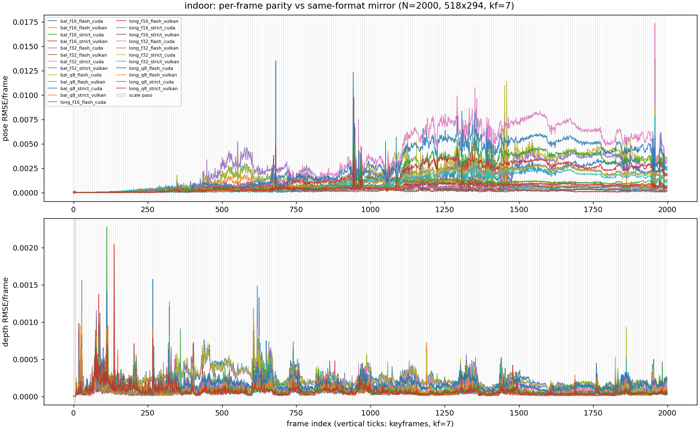

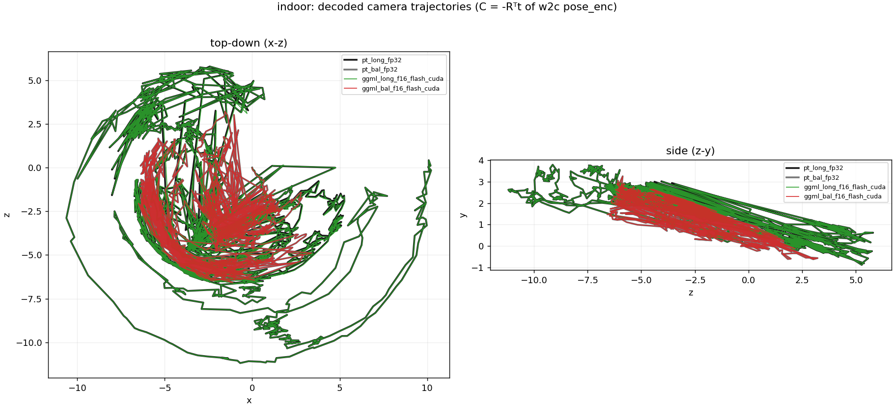

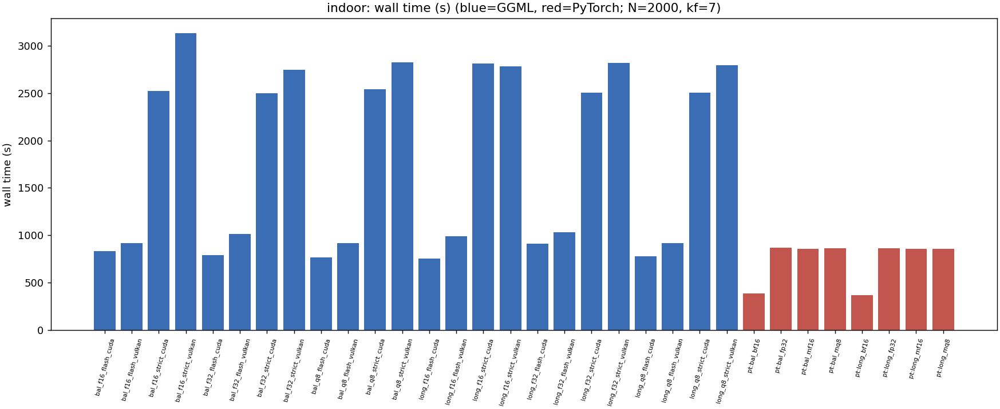

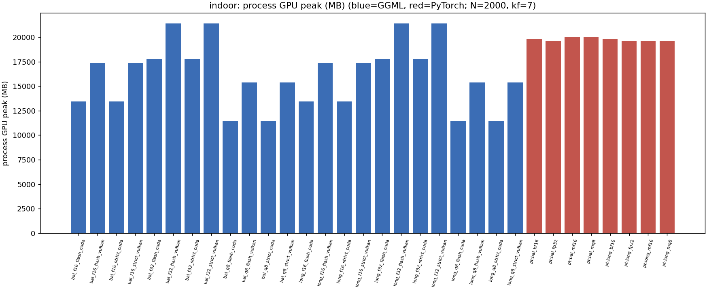

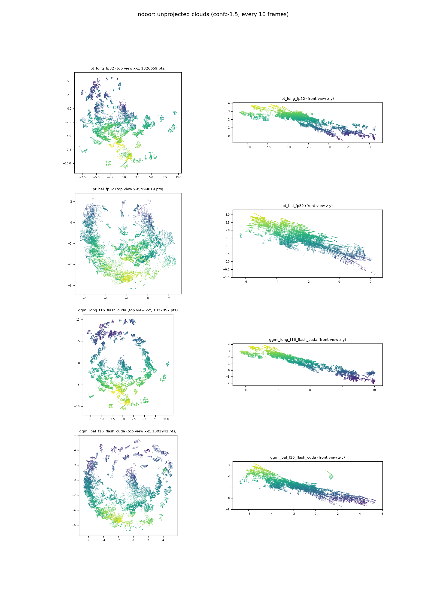

## latency_matrix
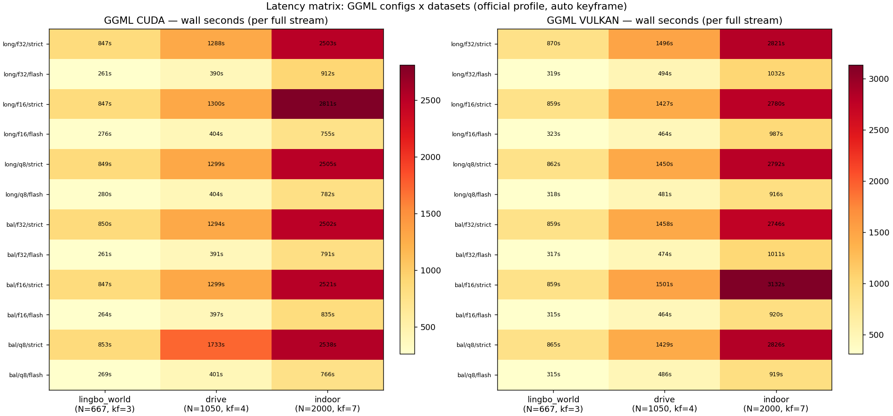

## fps_scaling
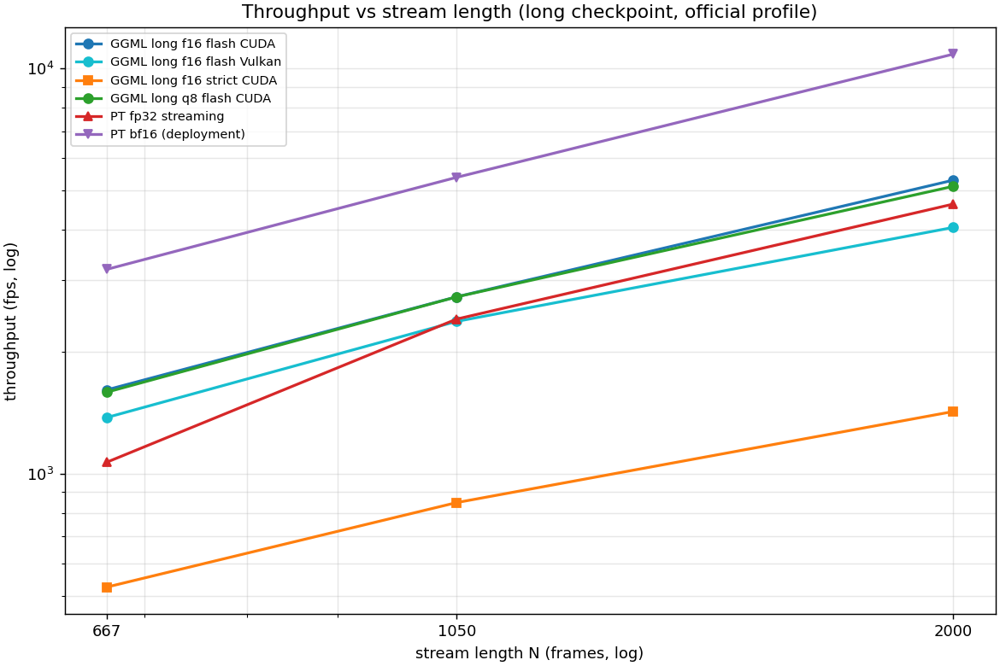

## latency_breakdown
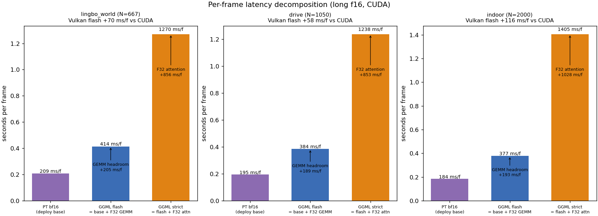
